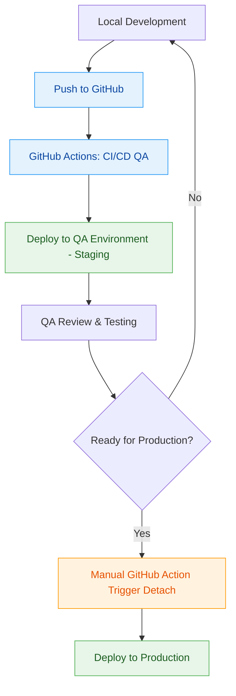
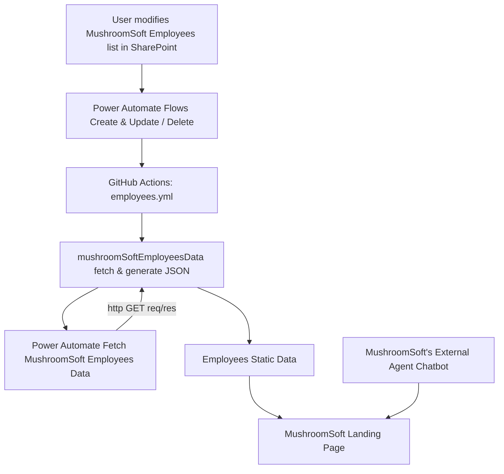
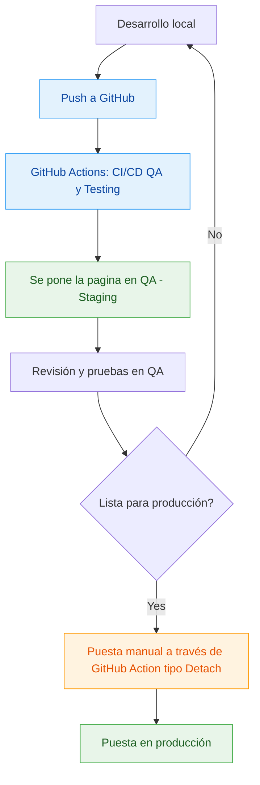
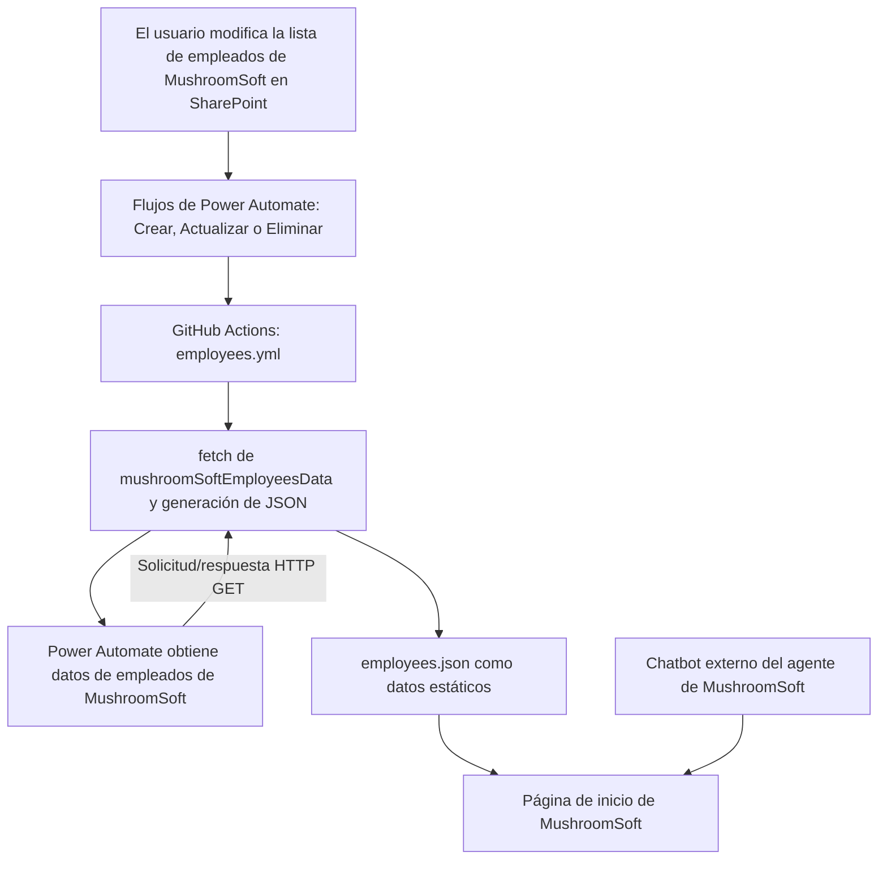

# MushroomSoft IT Site (EN)

This project is a web application developed with [Angular CLI](https://github.com/angular/angular-cli) version 18.2.4, designed to present institutional information about MushroomSoft, including automations with Power Automate and an interactive chatbot.

_Internationalization: The application is designed with multi-language support in mind. Future releases will include translations in English and Spanish._

## Development Server

Run `ng serve -o` to start the development server. Navigate to `http://localhost:4200/`. The application will automatically reload if you change any source files.

## Code Generation

Run `ng generate component component-name` to generate a new component. You can also use:

```bash
ng generate directive|pipe|service|class|guard|interface|enum|module
```

## Build

Run `ng build` to build the project. The build artifacts will be stored in the `dist/` directory.

## Unit Tests

Run `ng test` to run unit tests using [Karma](https://karma-runner.github.io).

## End-to-End Tests

Run `ng e2e` to run end-to-end tests using a platform of your choice. To use this command, you first need to add a package that implements end-to-end testing capabilities.

## Additional Help

To get more help on Angular CLI, run:

```bash
ng help
```

Or visit the [official Angular CLI documentation](https://angular.dev/tools/cli).

## Dependency Installation

This project uses [pnpm](https://pnpm.io/) as the package manager. Install it if you haven't already:

```bash
npm install -g pnpm
```

---

## Environments

The project has the following environments:

- **Local Development**  
  URL: `http://localhost:4200/`  
  Used for active development, testing, and validation.

- **QA**  
  URL: `https://msoftpublicsite.z13.web.core.windows.net/`  
  Used for testing and validation.

- **Production**  
  URL: `https://mushroomsoft-it.com/`  
  Stable version of the site available for end-users. Requires review and approval.

* **Disclaimer: The QA environment is not stable and may contain experimental features or incomplete ones.**



## System Diagram



## Our Team - Our Team

Responsible for automating the employee list in the **'Our Team'** section.

### Solution **"MushroomSoft Employees"**

It includes three **Power Automate** flows:

1. Fetch MushroomSoft Employees Data (HTTP Request trigger): retrieves, processes, and updates the employee list in SharePoint.
2. MushroomSoft Employees - Create & Update - GitHub Action API Request (SharePoint Trigger): detects creation or update of an item in SharePoint and triggers flow 1.
3. MushroomSoft Employees - Deleted - GitHub Action API Request (SharePoint Trigger): detects when an item is deleted in SharePoint and triggers flow 1.

Staging in Power Platform:

1. MushroomSoft's Business Unit Development Environment: for development and testing.
2. MushroomSoft's Shared Production Environment: for production.

- Important: Flows connected to both the QA and Production pages are production flows.

CI/CD:

- Pipeline: **MushroomSoft's Pipeline**
- Lifecycle management with Git.
- GitHub Actions: employees.yml

Product Lifecycle:

1. A change is detected in the SharePoint list (creation, edit, or deletion) via flows 2 and 3.
2. Flows 2 and 3 trigger the GitHub Action 'employees.yml'.
3. The GitHub Action runs a flow responsible for calling the scripts inside the 'scripts' folder, which in turn calls flow 1.
4. Files inside the 'scripts' folder retrieve and process the data.

Additional notes:

- The solution works with SharePoint data lists from two separate sites.
- For restricted information: Contact MushroomSoft's IT department and request the corresponding information about this solution.

## Copilot Studio - Chatbot -

### Solution **"MushroomSoft's External Agent"**

Responsible for addressing customer inquiries and bringing them closer to the organization.

1. Available in the lower-right corner (in mobile view, it is at the bottom center).
2. The agent/chatbot is called **MushroomSoft's External Agent**, created in Copilot Studio.

Staging in Power Platform:

1. MushroomSoft's Business Unit Development Environment: development and testing.
2. MushroomSoft's Shared Production Environment: production.

- Important: The chatbot connected to both the QA and Production pages is the production chatbot.

CI/CD:

- Pipeline: **MushroomSoft's Pipeline**.
- Lifecycle management with Git.

Additional notes:

- For restricted information: Contact MushroomSoft's IT department and request the corresponding information about this solution.

# MushroomSoft IT Site (ES)

Este proyecto es una aplicación web desarrollada con [Angular CLI](https://github.com/angular/angular-cli) versión 18.2.4., diseñada para presentar información institucional de MushroomSoft, incluyendo automatizaciones con Power Automate y un chatbot interactivo.

## Servidor de desarrollo

Ejecuta `ng serve -o` para iniciar el servidor de desarrollo. Navega a `http://localhost:4200/`. La aplicación se recargará automáticamente si cambias alguno de los archivos fuente.

## Generación de código

Ejecuta `ng generate component component-name` para generar un nuevo componente. También puedes usar:

```bash
ng generate directive|pipe|service|class|guard|interface|enum|module
```

## Compilación

Ejecuta `ng build` para compilar el proyecto. Los artefactos de compilación se almacenarán en el directorio `dist/`.

## Pruebas unitarias

Ejecuta `ng test` para ejecutar las pruebas unitarias mediante [Karma](https://karma-runner.github.io).

## Pruebas end-to-end

Ejecuta `ng e2e` para ejecutar las pruebas end-to-end usando una plataforma de tu elección. Para usar este comando, primero necesitas agregar un paquete que implemente capacidades de pruebas end-to-end.

## Ayuda adicional

Para obtener más ayuda sobre Angular CLI, ejecuta:

```bash
ng help
```

O visita la [documentación oficial de Angular CLI](https://angular.dev/tools/cli).

## Instalación de dependencias

Este proyecto utiliza [pnpm](https://pnpm.io/) como gestor de paquetes. Instálalo si aún no lo tienes:

```bash
npm install -g pnpm
```

---

## Entornos

El proyecto cuenta con los siguientes entornos:

- **Desarrollo local**  
  URL: `http://localhost:4200/`  
  Utilizado para desarrollo activo, pruebas y validaciones.

- **QA**  
  URL: `https://msoftpublicsite.z13.web.core.windows.net/`  
  Utilizado para pruebas y validaciones.

- **Producción**  
  URL: `https://mushroomsoft-it.com/`  
  Versión estable del sitio disponible para los usuarios finales. Requiere revisión y aprobación.

* **Disclaimer: El ambiente QA no es estable y puede contener características experimentales o pueden estar incompletas.**



## Diagrama del sistema



## Nuestro Equipo - Our Team

Encargado de automatizar la lista de empleados en la Sección **'Nuestro equipo'**.

### Solución **"MushroomSoft Employees"**

Cuenta con tres flujos de **Power Automate**:

1. Fetch MushroomSoft Employees Data (HTTP Request trigger): obtiene, procesa y actualiza la lista de empleados en Sharepoint.
2. MushroomSoft Employees - Create & Update - GitHub Action API Request (Sharepoint Trigger): detecta una creación o actualización de un elemento en Sharepoint y ejecuta el flujo 1.
3. MushroomSoft Employees - Deleted - GitHub Action API Request (Sharepoint Trigger): detecta que un elemento en Sharepoint ha sido eliminado y ejecuta el flujo 1.

Staging en Power Platform:

1. MushroomSoft's Business Unit Development Environment: para desarrollo y pruebas.
2. MushroomSoft's Shared Production Environment: para producción.

- Importante: Los flujos conectados tanto a la página QA como Producción son los de producción.

CI/CD:

- Pipeline: **MushroomSoft's Pipeline**
- Gestión del ciclo de vida con Git.
- GitHub Actions: employees.yml

Ciclo de vida del producto:

1. Se detecta un cambio en la lista de Sharepoint (creación, edición o eliminación) por medio de los flujos 2 y 3.
2. Los flujos 2 y 3 realizan un llamado a la GitHub Action 'employees.yml'.
3. La GitHub Action ejecuta un flujo encargado de llamar a los archivos contenidos en la carpeta 'scripts' encargados de llamar al flujo 1.
4. Los archivos dentro de la carpeta 'scripts' obtienen la información y la procesan.

Notas extras:

- La solución trabaja con listas de datos de Sharepoint en dos sitios independientes (uno para desarrollo y otro para producción).
- El resto de información es restringida: Contacte con el departamento de IT de MushroomSoft y solicite la información correspondiente a esta solución.

## Copilot Studio -Chatbot-

### Solución **"MushroomSoft's External Agent"**

Encargado de resolver dudas de los clientes y acercarlos a la organización.

1. Disponible en la esquina inferior derecha (en móviles en la parte inferior central).
2. El agente/chatbot se llama **MushroomSoft's External Agent**, realizado en Copilot Studio.

Staging en Power Platform:

1. MushroomSoft's Business Unit Development Environment: desarrollo y pruebas.
2. MushroomSoft's Shared Production Environment: producción.

- Importante: El chatbot conectado tanto a la página QA como Producción es el de producción.

CI/CD:

- Pipeline: **MushroomSoft's Pipeline**.
- Gestión del ciclo de vida con Git.

Notas extras:

- El resto de información es restringida: Contacte con el departamento de IT de MushroomSoft y solicite la información correspondiente a esta solución.
